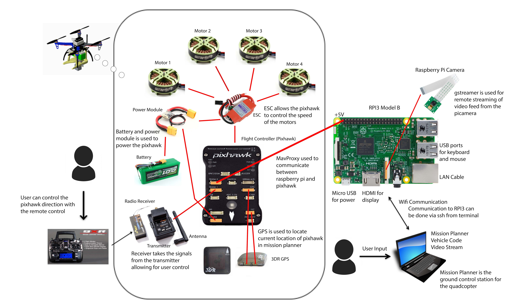
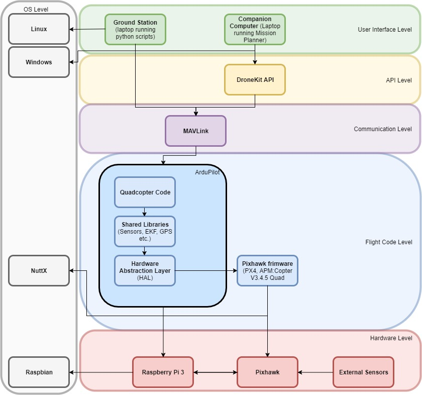
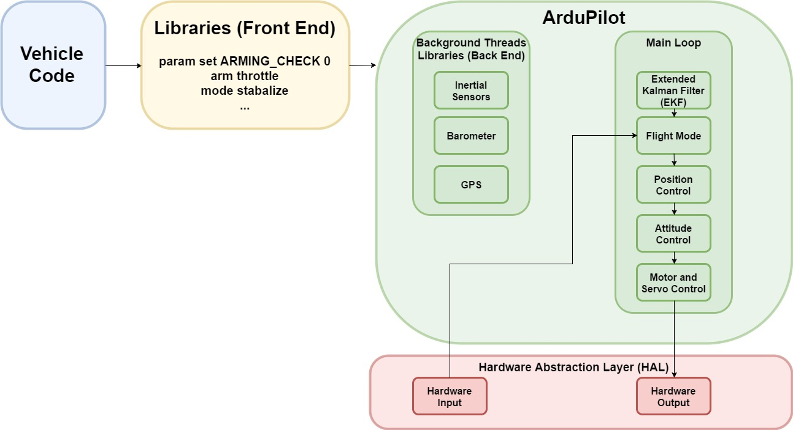

Quadcopter - AutoMAV OF Project HEARTBEAT
===================

Software Design
---------------

**Figure 1 Network Diagram**

**Figure 2 Interface Design Description**

**Figure 3 Ardupilot software block diagram**

**Figure 4 Take Off Software Block Diagram**

### Source Lines of Code for Basic Flight Test
#### Pre-arm Checks
Arming the vehicle turns on the motors for the Copter, however before arming it needs to go through pre-arm checks which includes checking for a GPS lock, and an Extended Kalman Filter (EKF) algorithm to estimate vehicle position, velocity and angular orientation based on rate gyroscopes, accelerometer, compass, GPS, airspeed and barometric pressure measurements

    print "Basic pre-arm checks"
    #Don't let the user try to arm until autopilot is ready
    while not vehicle.is_armable:
	    print " Waiting for vehicle to initialise..."
	    time.sleep(1)

#### Arming and takeoff
Once the vehicle has passed the pre-arm checks, and is_armable returns true, we can then set the vehicle mode to GUIDED, and wait till the motors have been completely armed before taking off

	print "Arming motors"
    #Copter should arm in GUIDED mode
    vehicle.mode = VehicleMode("GUIDED")
    vehicle.armed = True
    while not vehicle.armed:
	    print " Waiting for arming..."
	    time.sleep(1)
    print "Taking off!"
    vehicle.simple_takeoff(aTargetAltitude) 
    #Take off to target altitude

#### Taking off precautions 
The takeoff command is asynchronous and can be interrupted if another command arrives before it reaches the target altitude. This could have potentially serious consequences if the vehicle is commanded to move horizontally before it reaches a safe height. To address these issues, the function waits until the vehicle reaches a specified height before returning.

	 while True:
	     print " Altitude: ", vehicle.location.global_relative_frame.alt
		 #Break and return from function just below target altitude.
		 if vehicle.location.global_relative_frame.alt>=aTargetAltitude*0.95:
		     print "Reached target altitude"
		     break
	     time.sleep(1)

#### Landing 
The landing command is taken care off by the dronekit api, this can be initiated in two ways, if we want to land at the current position the drone is we set the mode to LAND, otherwise if we want it land where we started the mission, set the mode to RTL, at the end we need to make sure that the script closes the vehicle and shuts off all the motors

    #The example is completing. LAND at current location.
    print("Setting LAND mode...")
    vehicle.mode = VehicleMode("LAND")
    #The example is going back to home location and landing
    print("Setting RTL mode...")
    vehicle.mode = VehicleMode("RTL")
    #Close vehicle object before exiting script
    print "Close vehicle object"
    vehicle.close()
  
